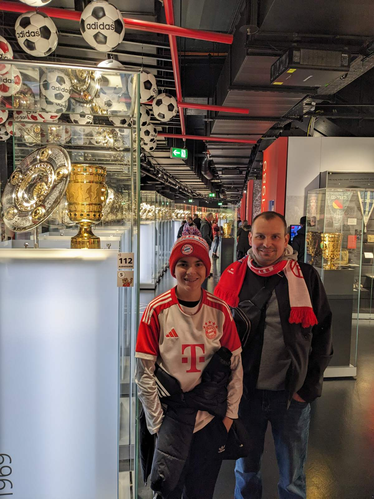

---
date:
  created: 2024-11-22
---

# Our first full day

Still somewhat jet-lagged, we woke up around 9. V and I walked to the nearest bakery to get some Kaisersemmel (traditional rolls in Bavaria) for breakfast. Kids are absolutely loving the fresh baked goods here so we'll be repeating this daily until we leave I think. 
<!-- more -->

We then took off to the Marienplatz (Old Town) and just caught the world-famous Glockenspiel playing at noon with its 43 bells. Vedran couldn't wait to get to the FC Bayern Munich fan shop around the corner where we spent over an hour browsing countless products spread across 3 floors. We ended up buying just a few things at this fan shop knowing that we would buy our new gear at the Allianz Arena before the game. 

By the time we got out of the fan shop, we were ready for an afternoon beverage. We headed to a famous cafe at the Marienplatz for some coffee, hot chocolate, and a beer of course. We were squeezed for time since our Museum tour at the Allianz Arena ahead of the game started at 5pm and we still had to go back to the apartment to dress for freezing tempretures forecasted for that evening. On our way back to the apartment, we stopped at a small food court for a quick bite. Pamela had a fried cheese sandwhich while the kids shared a large schnitzel sandwhich. 

Once we put on some serious winter gear, we headed to the arena via U-Bahn (subway). We arrived just in time for the Museum tour and we had 90 minutes to get through the museum and the fan shop before the arena opened for the game. After a hefty bill at the fan shop, we headed to the arena pub for some beverages. The place was absolutely packed and the atmosphere was incredible, as one would expect before a Friday night game. We made it to our seats about an hour before kickoff as the snow was falling heavily and the temperature fell below zero. I'm not able to describe what V and I felt walking into the arena for the first time. As a matter of fact, I'll let Vedran tell you when we get back.

An absolutely overwhelming day came to an end as we took the subway back into the city together with at least half of the 75,000 fans. We made it home around midnight and crashed quickly.

|              Image Gallery               |
|:----------------------------------------:|
|  |
|  |
|  |
|  |
|  |
|  |
|  |
|  |
|  |
|  |
|  |
|  |
|  |
|  |
|  |
