---
date:
  created: 2024-11-23
---

# Our first of many Christmas markets

This morning we woke up late after sleeping in until about 10. It was a late night at the soccer game and none of us went to bed before midnight the night before. 
<!-- more -->

We had breakfast in the apartment and then headed once again to Altstadt (Old Town) to walk around and do some some sightseeing. We tried to get into the Hofbrauhaus but that was an impossible task on a Saturday. We ended up finding a small cafe for a quick pit stop before heading to the Munich Residenz, which is a huge palace built back in 1385. After about 2 hours of walking the 130 rooms (that's no joke), we visited the Weihnachtsdorf (Christmas Village) in the very courtyard of the palace. Gluhwein (hot, spiced wein) was the first priority here before tasting some Crepes filled with strawberries and Nutella. We finished off the evening with an awesome dinner at Der Pschorr, where most of us tasted the traditional Schnitzel dish. Tomorrow is a long day at the Neuschwanstein Castle with our tour bus leaving Munich around 9am. 

|              Image Gallery               |
|:----------------------------------------:|
| 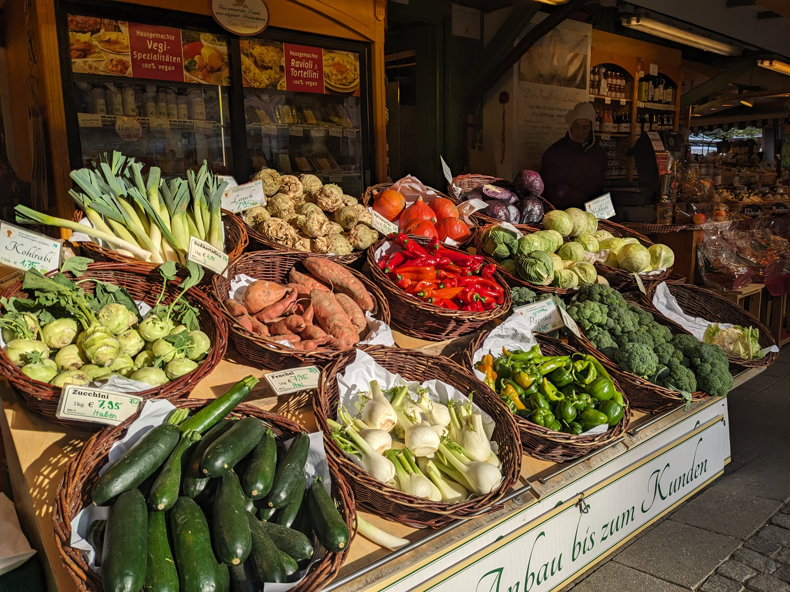 |
| 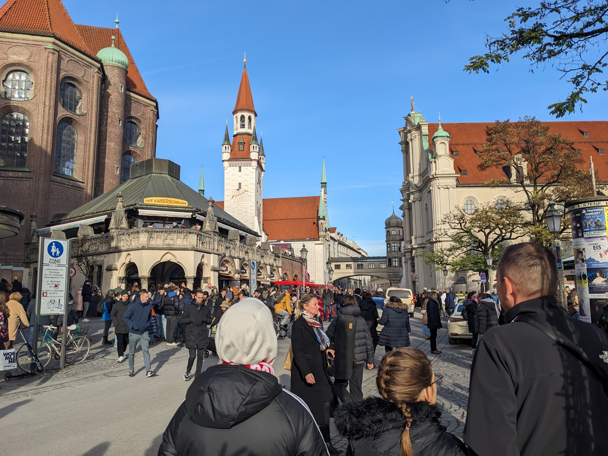 |
|  |
| 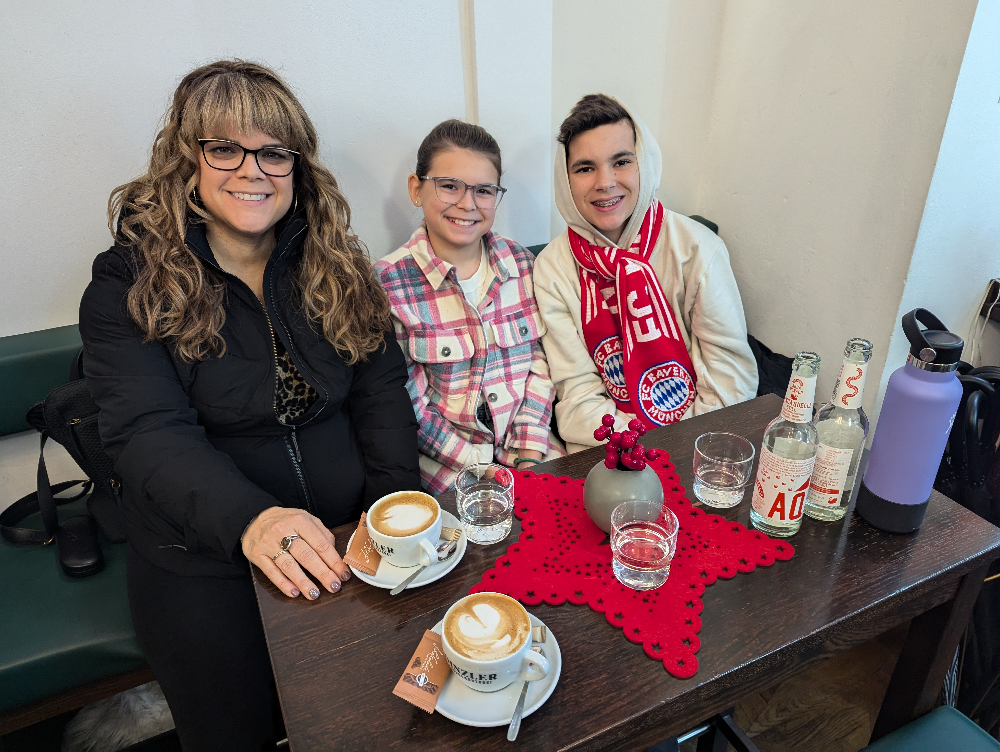 |
|  |
| 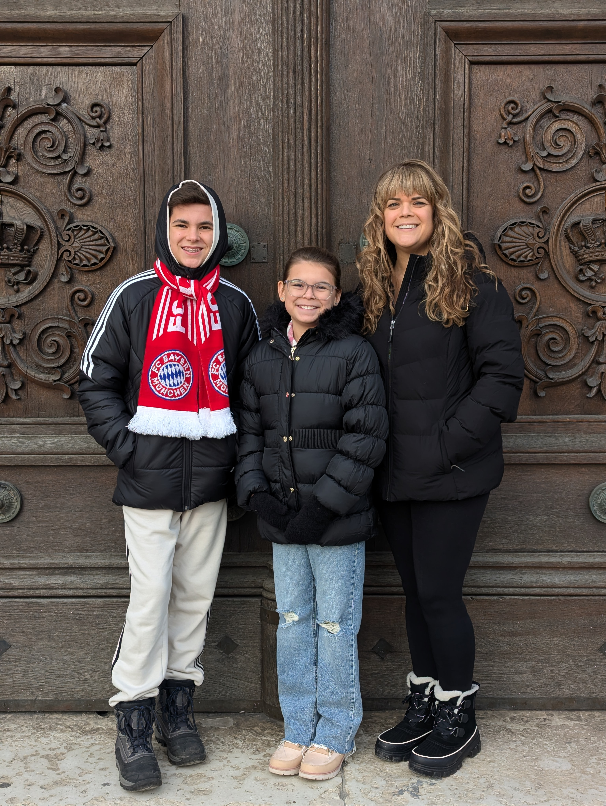 |
| 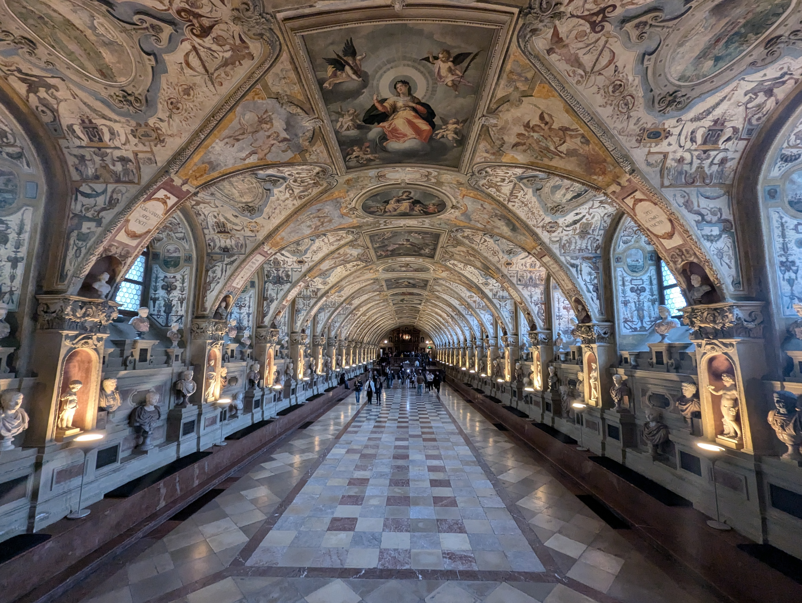 |
| 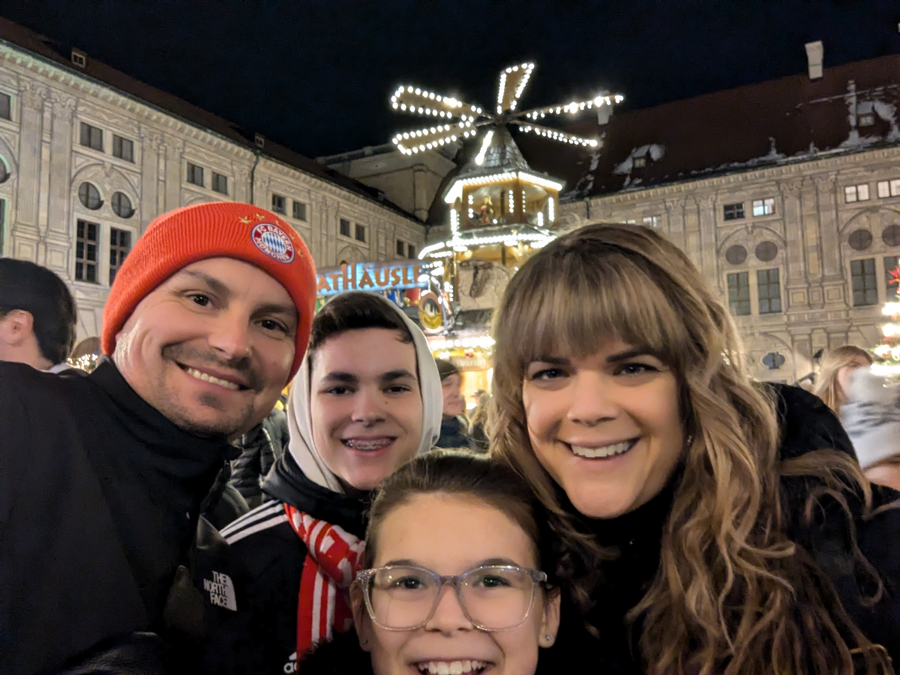 |
| 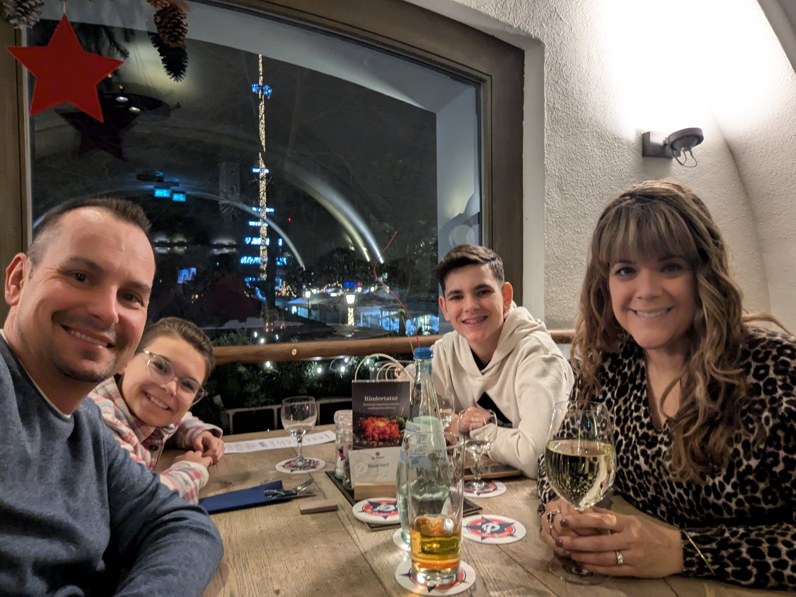 |
| 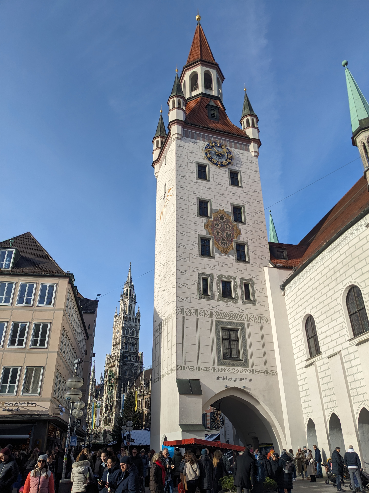 |
| 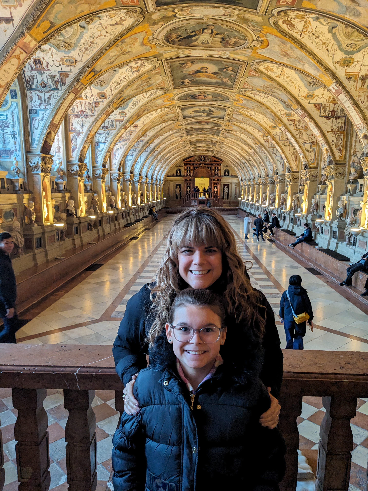 |
| 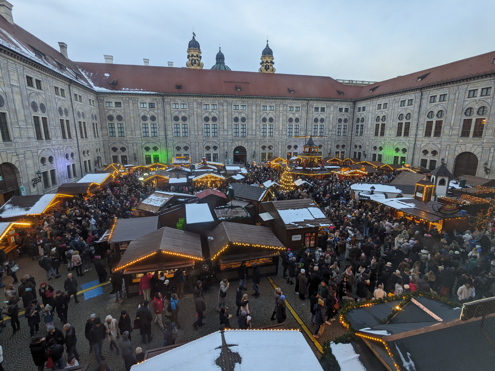 |
| 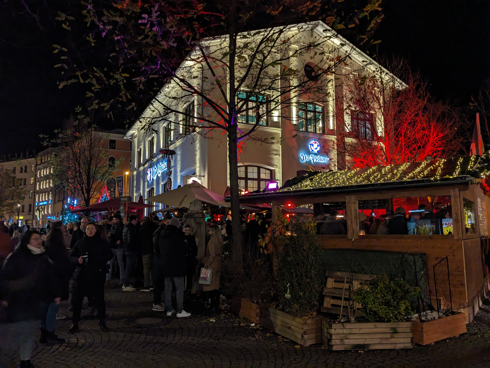 |