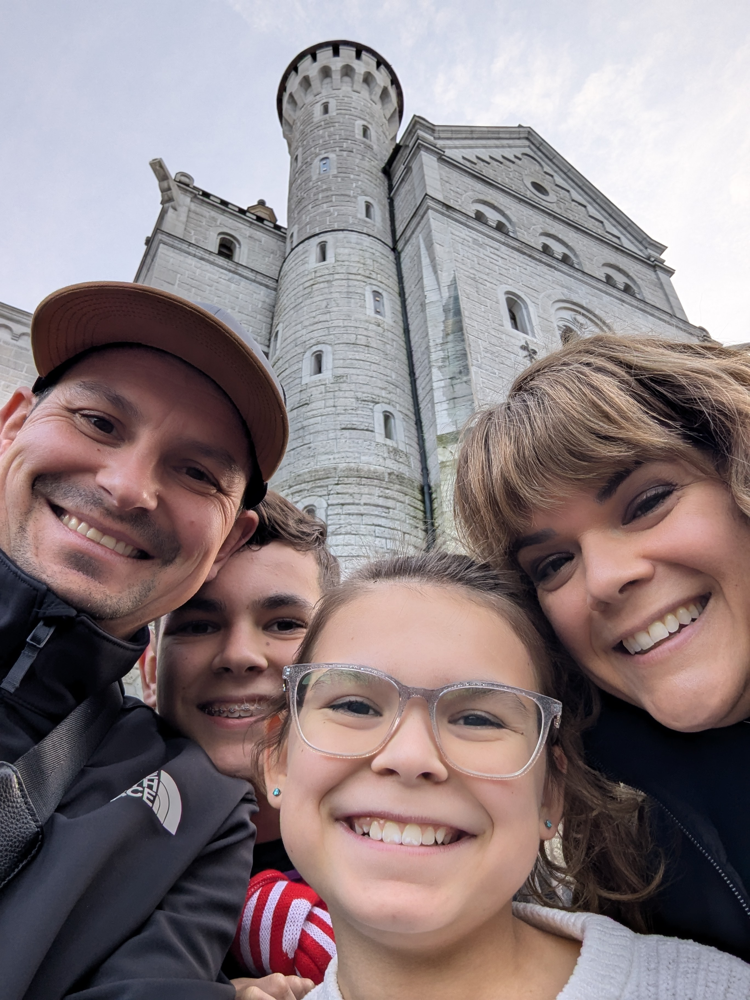

---
date:
  created: 2024-11-24
---

# Hiking the Alps to Neuschwanstein

Today was Neuschwanstein Castle tour day, which meant an early wake-up in order to meet up at the tour office and catch the train to Fussen. Our tour guide named Thomas has been to the castle a hundred times this year alone...do I need to say more about him? 
<!-- more -->

We took off for a two hour train ride around 10am and as you would expect from a German train system, we arrived in Fussen at exactly the scheduled time. For the entire two hour trip, Thomas was educating the group on the very short and peculiar life of King Ludwig II. Once we got off the train, we boarded a bus for a quick ride up to the Village of Hohenschwangau, which is where the castle is located. With 45 minutes to spare before our hike to the castle, we took a quick pitstop at a traditional Bavarian restaurant for some weiss wurst, pretzels, and a beer. At 12:45 we began our very steep hike up to the castle that took approximately 20-30 minutes, with Thomas taking a break every 10 minutes for all of us to catch our breath. Once we reached the castle, our next and impossible task was to capture the breathtaking views of the Neuschwanstein Castle. As beautiful as some pictures turned out, they don't even come close to capturing the size and elegance of this massive structure. Once we explored the exterior of the castle, we began our interior tour. Unfortunately you won't see any pictures of the interior, as smart phones and cameras during the interior tour are stricktly forbidden, with the exception of the castle kitchen. Before exiting the castle, we went out to the balcony and captured some awesome views of the Alps surrounding the castle and the village below. At around 3:45pm, we headed back down to the village to meet up with the group and head back to Munich. Hungry from a long day of walking, climbing, and hiking, we ate dinner at a very nice Vietnamese restaurant in our neighborhood. The food here was a pleasant change from the bratwursts and schnitzels we've been sampling since our arrival. 

|              Image Gallery               |
|:----------------------------------------:|
|  |
|  |
|  |
|  |
|  |
|  |
|  |
|  |
|  |
|  |
|  |
|  |
|  |
|  |
|  |
|  |
|  |