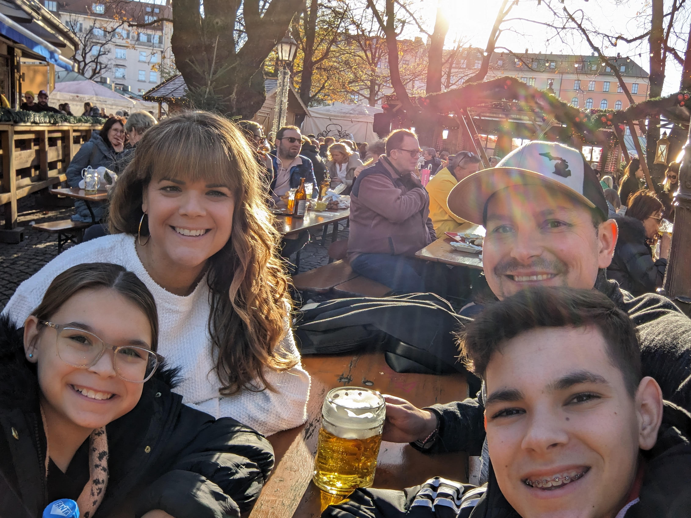

---
date:
  created: 2024-11-25
---

# Another busy day in and around Old Town

This morning started off with a trip to the grocery store, followed by a quick breakfast. We then took off to the Bayern Munich training center on Sabener Strasse hoping to run into some players as they were driving in for another day of practice before the big game tomorrow. We must have however missed all of them by just a few minutes, as a small crowd of fans was slowly leaving the garage entrance of the training facility, as we were approaching. We quickly visited the fan shop there and took some pictures. 
<!-- more -->

Next on our list was the Viktualienmarkt which is a year-round outdoor market. We enjoyed the beautiful weather by taking a quick break at the "Biergarten" located on the market grounds. After a small incident caused by the local pigeons sitting on large tree branches above us, we made our way to the Hofbrauhaus for some more beer, wine, and pretzels. The place was not as busy as on Saturday, and we found a table fairly quickly. After about an hour, we continued our walk towards the Frauenkirche (Women's church) and the St. Michael's Church, where we saw the tomb of King Ludwig II. You'll remember him as the builder of the Neuschwanstein castle. As it was getting dark, we made our way to the Marientplatz Christmas Market for some snacks and Gluhwein (hot spiced wine). Hope you enjoy the pictures, though similar to yesterday, it's really hard to capture the beauty of the city hall at night during the holiday season. Before we walked over to the Medieval Christmas Market where vendors pay tribute to the old Munich city culture, we stopped by the fan shop once again so I could get a special scarf with custom embroidery of tomorrow's game. We finished our evening with some Crepes at the medieval market before taking the subway back to the apartment. If you're asking how Ajla is keeping up with all this walking, I don't have an answer. She's been an absolute champ on this trip, and I believe that all the dancing and tumbling classes have greatly prepared her for this trip. 

|              Image Gallery               |
|:----------------------------------------:|
|  |
|  |
|  |
|  |
|  |
|  |
|  |
|  |
|  |
|  |
|  |
|  |
|  |