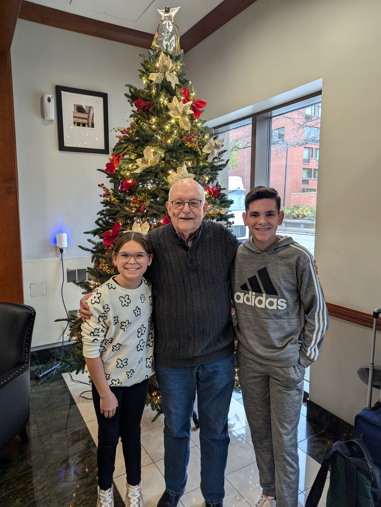

---
date:
  created: 2024-11-20
---

# Made it to O'Hare

After a long drive, we made it to Chicago and finally to O'Hare where we depart from at 6pm CST. 

<!-- more -->

Our drive to Chicago was smooth but we paid for it on our way to O'Hare which took over an hour from the very familiar 1101 S. State a.k.a Casa Miller. Robert met us downstairs and we spent just enough time with him to snap this photo (see gallery) before our Uber came to pick us up. After an hour drive, we made it to Terminal 1 and had a well deserved snack and bevarage at Burghoff's Cafe, which some of you will recognize as they have a restaurant on West Adams St. and it is a very famous German-style restaurant in the city. How fitting? Anyway, we just boarded and should be taking off on time. We'll call you from the old continent.  

|              Image Gallery               |
|:----------------------------------------:|
|  |
|  |
|  |
|  |